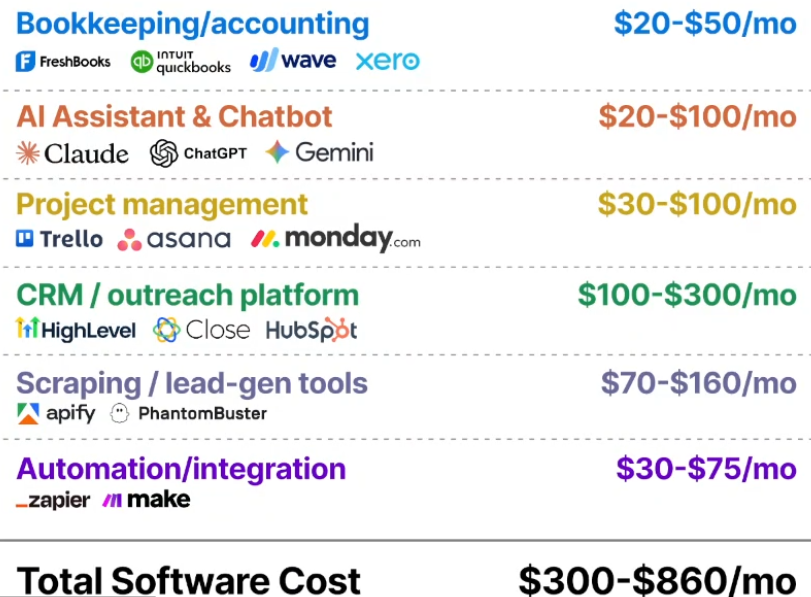

# [Topic Name]
**Source:** [Course / Playlist / Book — link] | **Started:** YYYY-MM-DD

## Overview
-

## Log
- Merchant trades value
- people pay you for the value you bring
- pick a proven in demand service
- pick a niche (a specific client type), for a specific domain
- 80% goes in sales and marketing
- look for existing websites and find ways on how to improve the sites
- set up outreach campaign
    - cold emails
- explain and close
- tools
- 3 hours for the next 90 days, 20 Hours a week

- Target
    - be able to quit my job and replace that income
    - target 3 clients as a start

### [Unit / Video / Chapter Name] — YYYY-MM-DD
- Key takeaways:
-
- Questions / Gaps:
-

## Insights & Opinions
-

## Links to Projects
-
