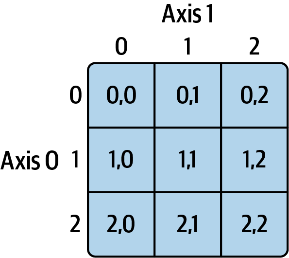

# Numpy

**Date:** 2026-05-14 | **Track:** Technical | **Session:** XX

## Key Concepts

- Why ND array
  - Because numpy can handle n dimensional array. (1D, 2D, 3D .. ND)

- Defining a numpy array

  ```python
  import numpy as np
  # here is a sample data - distance traveled by Bike Riders in miles

  distance_traveled = [ 110 , 410 , 220 , 350 , 460 ]
  # in order to process and extract numerical facts i must convert the type of data

  # from LIST - > ND Array
  myArray = np.array( distance_traveled ) # conversion from list -> nd Array
  ```

- Basic numerical functions of numpy

  ```python
  print('Longest Distance Traveled ' , myArray.max())
  print('Shortest Distance Traveled ', myArray.min())
  print('Total Distance Traveled ', myArray.sum())
  print('Average Distance Traveled ', myArray.mean())
  print('Median Distance Value ', np.median( myArray ))
  print('Standard Deviation ' , myArray.std())
  ```

- Why the syntax for median is different
  - np.median() is provided by the Numpy module, it is not a function of ND Array (Data Structure)

- Python list do not support direct mathematical expression like

  ```python
  # python list
  distance_traveled  * 1.6

  # Exception:
  TypeError: can't multiply sequence by non-int of type 'float'
  ```

- ND Arrays support direct mathematical expressions. This is possible because of vectorization
- **Vectorization means being able to numerically compute each element of the array, without requiring a loop**

  ```python
  myArray * 1.6

  #output
  array([176., 656., 352., 560., 736.])
  ```

- ND Array features
  - Memory

    ```python
    import sys

    # python test
    print(sys.getsizeof(5),' bytes') # 28  bytes

    # ND Array
    print( myArray.itemsize,' bytes') # 8 bytes

    ```

- Working with 2D arrays
  - Syntax: Array[rowIndex, colIndex]
  - 
    - Axis 0 = Rows
      - I am collapsing the rows
      - squishing the array from top to bottom
      - move vertically down
    - Axis 1 = Columns
      - I am collapsing the columns
      - squishing the array from right to left
      - move horizontally across

## What I Built / Tried

-

## Insights & Opinions

-

## Questions / Gaps

-

## Links to Projects

-
