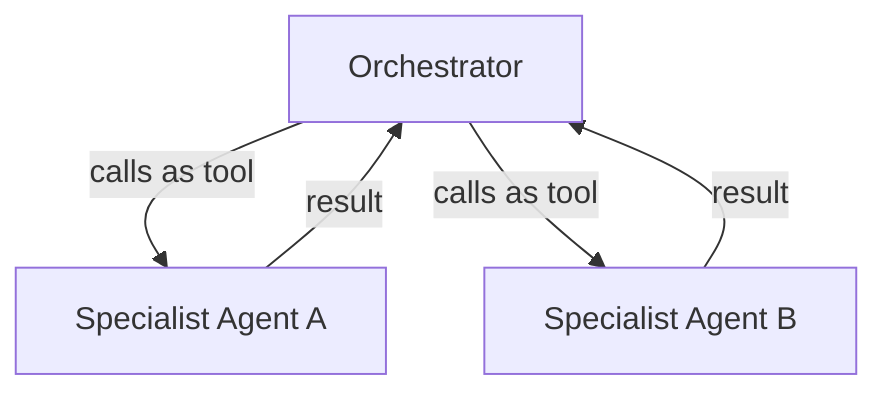
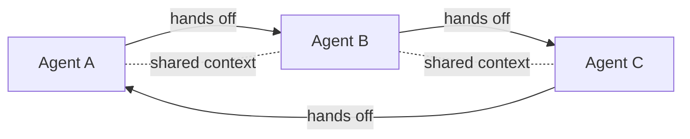
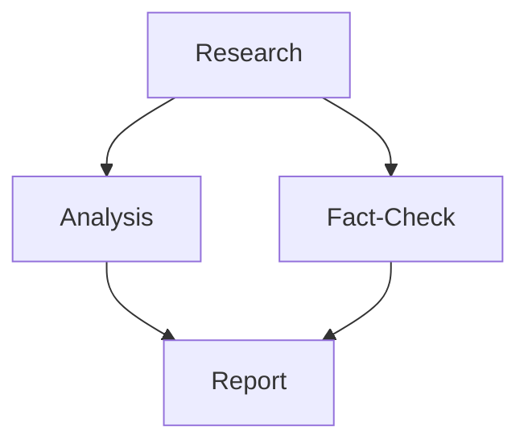
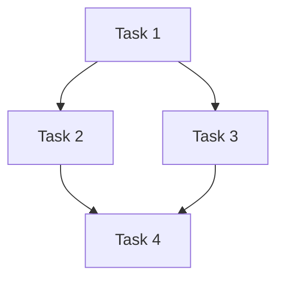

# Strands Agents SDK

**Date:** YYYY-MM-DD | **Track:** Technical | **Session:** XX

## Going In

-

## Key Concepts

- Strands Agents is an open source SDK for builing AI Agents

## Multi-Agent Patterns

Strands supports four core patterns for composing multiple agents ([source](https://strandsagents.com/docs/user-guide/concepts/multi-agent/multi-agent-patterns/)):

### Agents as Tools

- One agent invokes another agent as if it were a tool
- Enables hierarchical / composable agent systems (orchestrator + specialists)
- Good for: subtasks that need a specialized agent's capability, nested inside a bigger agent's flow

### Swarm

- Dynamic, collaborative team of agents that autonomously hand off tasks to each other
- Shared context (original request, task history, prior agents' knowledge) travels with the handoff
- Routing/handoff decisions are made by the agents themselves, not a developer-defined path
- Good for: problems needing multiple specialized perspectives (e.g. incident response, multi-discipline dev work)

### Graph

- Developer-defined directed graph — nodes are agents/custom nodes/nested multi-agent systems, edges are dependencies
- Supports both acyclic (DAG) and cyclic topologies (cycles need `maxSteps`/timeout to avoid running indefinitely)
- Shared state object is readable/writable by all agents; full dialogue history available at each node
- Good for: conditional logic, branching, loops with deterministic flow (e.g. routing support tickets by intent)

### Workflow

- Pre-defined task graph (DAG) executed as a single, reusable tool — deterministic execution
- Each task's output is automatically captured and passed as input to dependent tasks (no full shared conversation history)
- Independent tasks run in parallel; no cycles allowed; a failure halts its downstream dependents
- Good for: repeatable processes like data pipelines or onboarding, where steps have clear dependencies

**Quick comparison:** Swarm = emergent/agent-decided handoffs · Graph = deterministic branching with shared state & cycles · Workflow = fixed DAG of tasks, no shared conversation, built for repeatable pipelines.

## What I Built / Tried

-

## Insights & Opinions

-

## Questions / Gaps

-

## Links to Projects

-

## Coming Out

-
