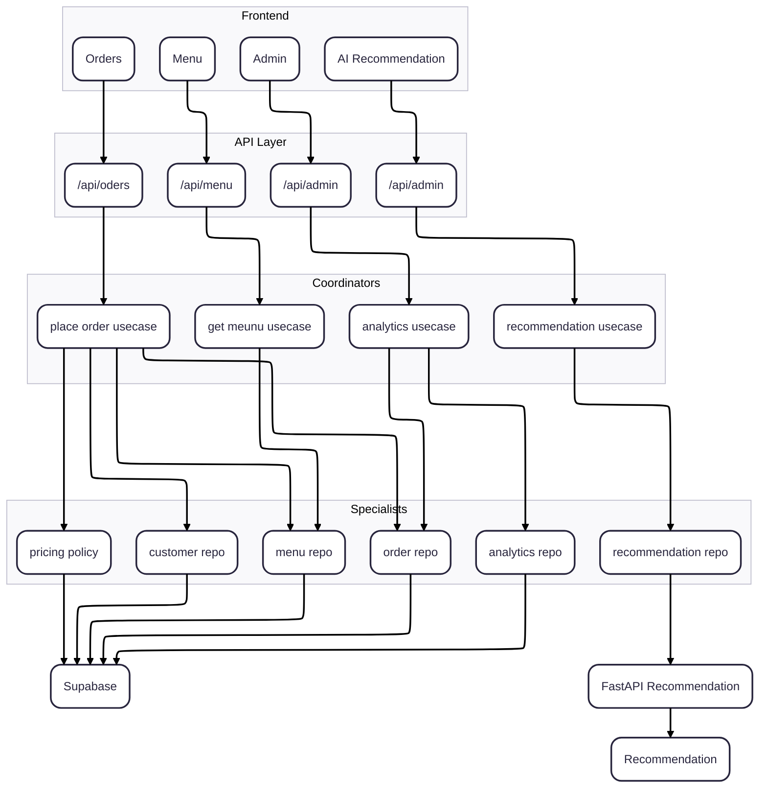

# Slice Matic Post Development Discussion

**Date:** 2026-11-07 | **Type:** Workshop

## What We Covered

- Slice Matic
  - Think in terms of the user
  - style it from the MVP
  - think of design at MVP stage
  - Which features can be classified as primary or secondary
  - Would we be putting it all in one git hub repo or keep it in a separate repo
  - Our primary services should not be affected when secondary services change
  - Have different services
  - Follow micro services architecture
  - Group dependant actions
  - Always have a coordinator below our APIs
  - Below coordinators we need specialists
  - Features (5-6 Features)
    - view the menu
    - choose base
    - choose pizza
    - choose topping
    - select quantity
    - calculate price
    - place the order

- HLD
  - Overview of a project
  - Core Services
    - Menu
    - Orders
    - Analytics
    - Recommendation reciever

  - DB Service
    - Database (Supabase)
  - AI recommendation

- Generic ideas on how to design a system
  - start with real user action
  - expand the hidden flow. Be as technical as possible
  - split the work that changes for different reasons
  - group replated work
  - hide replaceble tech

- Functions
  - Menu
    - Recieve the menu request
    - read the active bases, toppings, pizza from the DB
    - return the active menu
  - Order
    - Actions of the user
      - select the menu
      - check the cart
      - gets recommendations
      - searches
      - place the order
  - Admin View
    - Analytics Query
      - counting orders
      - total sales for the day
      - stock analysis

- LLD of Menu API
  - Access the menu
  - Menu Repository can be reused in Order API

- LLD of Recommendation reciever
  - Reuse Customer Repository

- LLD of Order API
  - hidden flow
    - recieve the item ids
    - validate the request
    - read the item prices
    - calculate the total
    - get the customer details using customer id
    - create a customer if required
    - save the order in the DB
    - return confirmation
  - split the work that changes for different reasons
  - Have a coordinator which will call the below specialists
    - Menu Repository
      - recieve the item ids
      - validate the request
      - read the item prices
    - Pricing policy
      - calculate the total
    - Customer Repository
      - get the customer details using customer id
      - create a customer if required
    - order repository
      - save the order in the DB
      - return confirmation

- 3 layer architecture
  - controller
  - manager

## What I Built / Key Takeaways

-

## Insights & Opinions

-

## Open Questions

- Architecture
  

